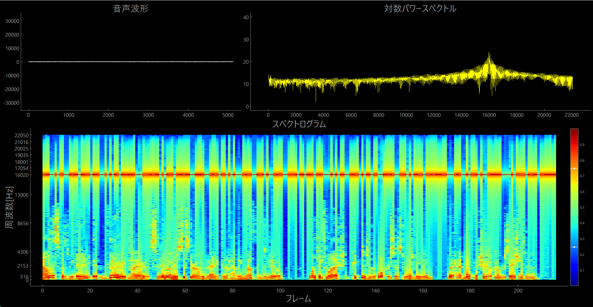

# Audio-Draw
再生されている音をマイクで収録，その音を波形やスペクトログラム等で可視化

## 概要
マイクから収録された音声の波形，対数パワースペクトル，スペクトログラムをリアルタイムでプロットする．
実装はすべてPython．ループバックを利用すれば，再生している音に対しても実行可能．

## 使用言語
- Python ver 3.8.1
## 使用ライブラリ
- PyAudio ver 0.2.11
- PyAutoGUI ver 0.9.53
- Pyqtgraph ver 0.13.1
- librosa ver 0.9.2
- PyQt6 ver 6.4.0
